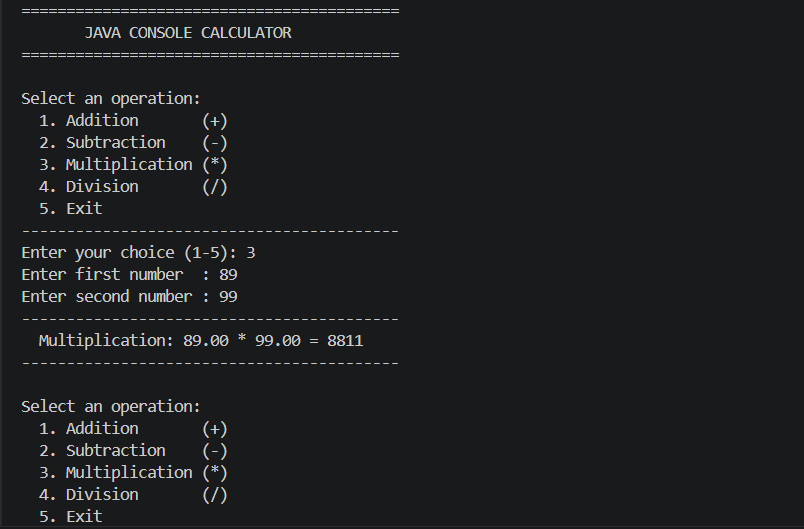

# Java Console Calculator

A basic command-line calculator built in Java as part of Task 1 of the Java Programming series.

## What I Did

Built a console-based calculator that takes user input from the terminal and performs arithmetic operations in a continuous loop until the user chooses to exit.

## Features

- Addition, Subtraction, Multiplication, Division
- Continuous loop — perform multiple calculations in one session
- Division by zero protection with a clear error message
- Input validation — handles non-numeric and out-of-range inputs gracefully

## Files

| File | Description |
|------|-------------|
| `Calculator.java` | Main Java source file containing all logic |
| `README.md` | Project documentation |

## How to Run

**Prerequisites:** Java JDK installed ([Download JDK](https://www.oracle.com/java/technologies/downloads/))

```bash
# 1. Clone the repository
git clone https://github.com/YOUR_USERNAME/java-console-calculator.git
cd java-console-calculator

# 2. Compile
javac Calculator.java

# 3. Run
java Calculator
```

## Sample Output

```
==========================================
       JAVA CONSOLE CALCULATOR
==========================================

Select an operation:
  1. Addition       (+)
  2. Subtraction    (-)
  3. Multiplication (*)
  4. Division       (/)
  5. Exit
------------------------------------------
Enter your choice (1-5): 1
Enter first number  : 25
Enter second number : 17
------------------------------------------
  Addition: 25.00 + 17.00 = 42
------------------------------------------
```

## Concepts Learned

- Java syntax and data types (`double`, `int`, `String`)
- Static methods with parameters and return values
- `Scanner` class for console input
- `switch` statement for menu navigation
- `while` loop for repeated execution
- `try/catch` for exception and input handling

## Tools Used

- Java JDK 17+
- VS Code / IntelliJ IDEA Community Edition
- Terminal / Command Prompt


Outputs :
